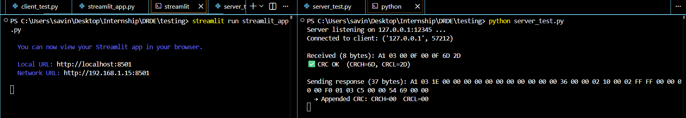

# Client-Server-Socket

We make a  Server & Client socket, using the Socket module, and make them communicate over their respective IPs.

## File Structure

ParentFolder<br>
|<br>
|-server_test.py<br>
|-crc_input.py<br>
|-streamlit_app.py<br> 

## Install streamlit
use command 
```bash
pip install streamlit
```

## Run

First run the server: 
```bash
python server_test.py
```
Then client:
```bash
 streamlit run streamlit_app.py
```


